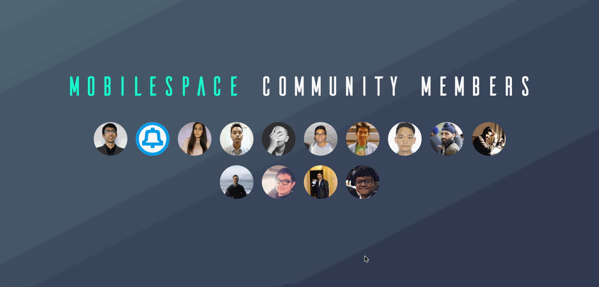
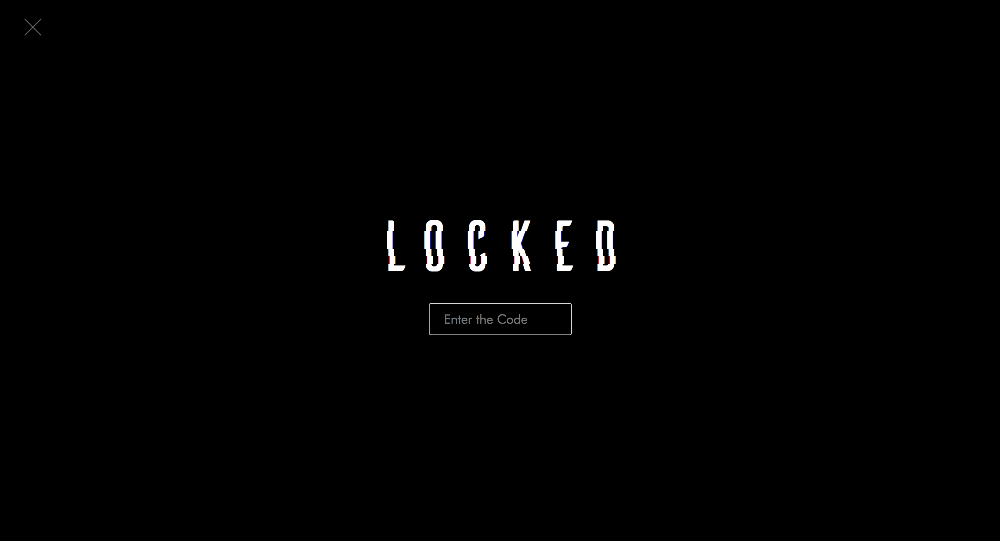
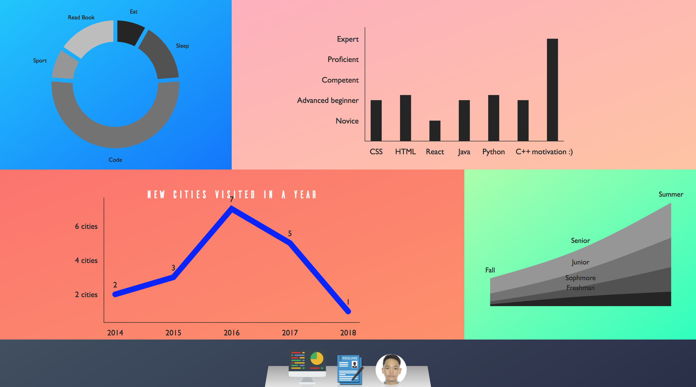
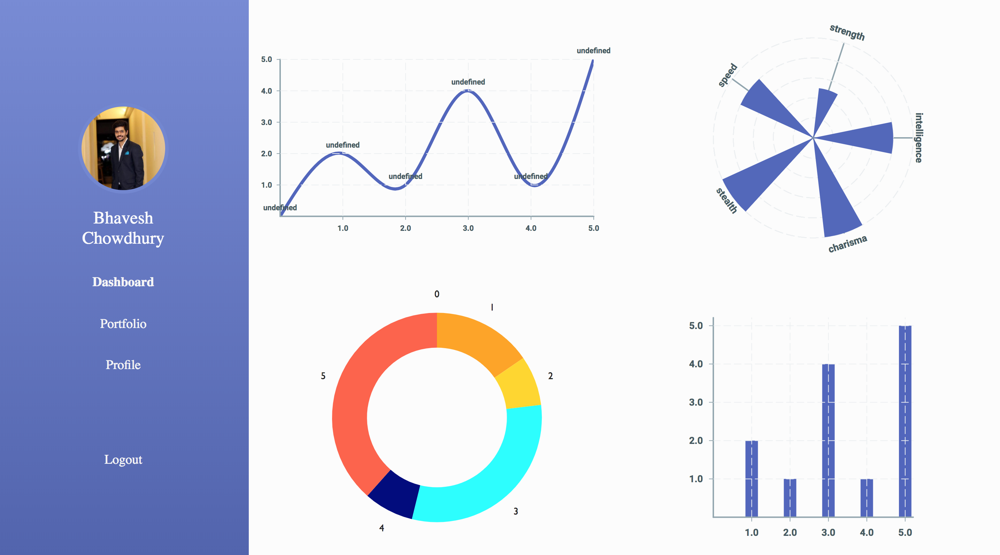

# MobileSpace - Community Members

This repo serves as an introduction to Github & web dev & React for MobileSpace Season 2 community members.

### [Demo - Website](https://mobilespace-members.netlify.com/)

## Getting started

Are you part of the MobileSpace Season 2 community? If so, please complete the following assignments and submit a pull request here! Someone will review (and merge) it.

## Assignment #1

### Objectives

- Learn the basics of Git & Github by forking this repo, making changes and submitting a PR
- Learn the basics of React & React Router by making the necessary changes needed to add yourself to this website

### TODO

- [x] Submit a PR adding yourself to this website
- [x] :star: **Bonus:** Change the `background` & `font-family` on your own homepage
- [x] :star: **Bonus:** Change the layout on your own homepage and add more relevant information to it

### Rockstars

## Assignment #2

### Objectives

- Learn the basics of JSX, using React state & props
- Learn how to use flexbox & other CSS styling

### TODO

- [x] [Create a locked screen with a secret phrase](https://i.redd.it/qes864onsgc01.png)
- [x] [Create a protected dashboard with the following 3 pages:](https://dribbble.com/tags/dashboard_ui)
  - [x] [Victory Charts Page](http://formidable.com/open-source/victory/) - Create 4 total charts - 1 of them has to be a custom chart made specifically for your dashboard
  - [x] Resume Viewer/ Portfolio Page
  - [x] Profile Page
- [x] :star: **Bonus:** Dig deeper into [Victory docs](http://formidable.com/open-source/victory/docs/) & create customized charts. Also update the layout on the dashbord. Look [here](https://dribbble.com/tags/dashboard_ui) for inspiration (dribble)
- [ ] :star: **Bonus:** Change the secret phrase to a password & change locked screen UI
  - [ ] :star: **Bonus:** Allow users to change secret phrase/password (update `secret = 'new_secret'` on SessionStorage)
- [ ] :star: **Bonus:** Cache whether the user entered the right secret phrase/password on the browser (update `unlocked = true` on SessionStorage)
  - [ ] :star: **Bonus:** Logout feature on dashboard (update `unlocked = false` on SessionStorage)
- [ ] :star: **Bonus:** Create a custom dashboard or use [ReactDnd Library](https://github.com/react-dnd/react-dnd) to allow the user to change the dock's position (top, left, right, bottom (default))

### Rockstars

## Problems?

Feel free to [**create an issue**](https://github.com/mobilespace/community-members/issues/new) when you have questions.

## Finally

This repository should be safe place for everyone to try things in. Be nice to each other and in case you have any questions or need help please reach out to **@monte9** (on Github or MobileSpace Slack)
